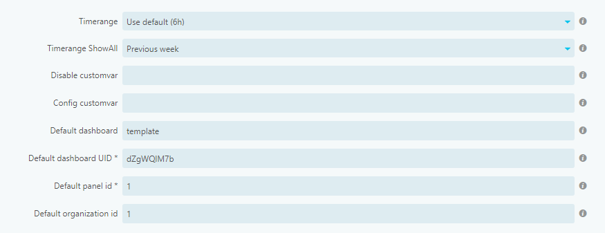
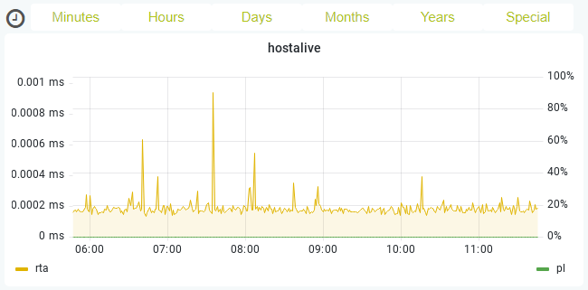
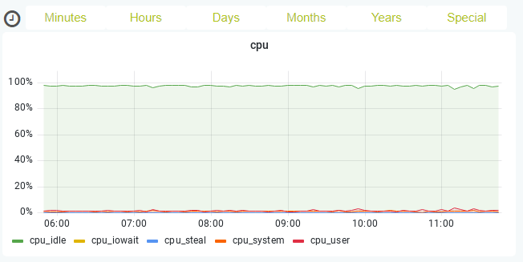
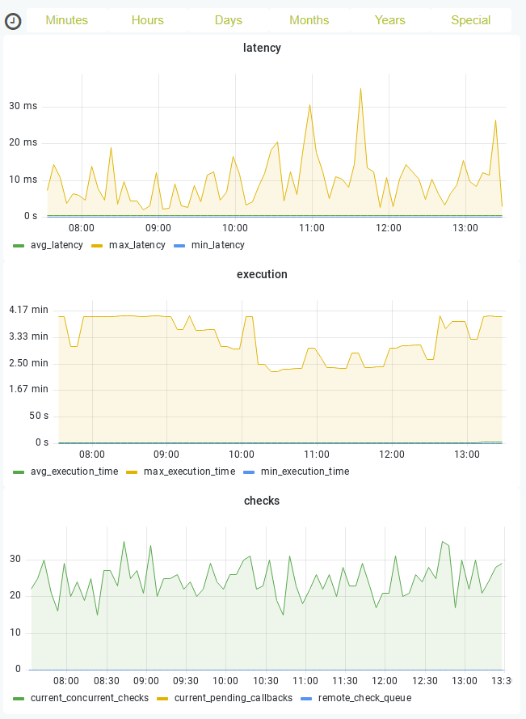
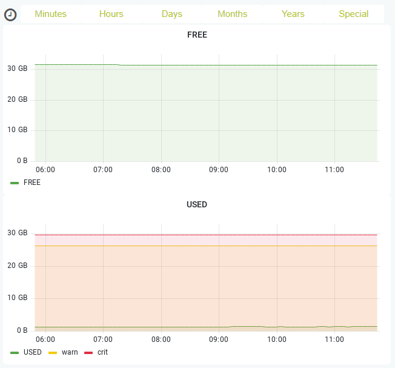

# Grafana Dashboards for Icinga with InfluxDB

Assumptions:
* Uses "default" Grafana data source
* Default dashboard is "template"

Hints:
* Tested with [Grafana](https://grafana.com/grafana/) v9.3.1 and [Grafana Module for Icinga Web](https://github.com/Mikesch-mp/icingaweb2-module-grafana/) v1.4.2
* Tested with [Icinga](https://icinga.com/) v2.13.6 and [InfluxDB](https://www.influxdata.com/) v2.4.0
* Uses "Time series" panels
* Currently only InfluxQL supported (Flux is planned afterwards)
* Panels can be selected according to your needs
* "template" Dashboard can be cloned and adjusted

## Dashboards 

| Name          | UUID      | Check Plugin       | Plugin Type                                                                                  | Repeatable | Suggested Panels |
| ------------- | --------- | ------------------ | -------------------------------------------------------------------------------------------- | ---------- | ---------------- |
| **cpu**       | EeILgQF4z | check_cpu_usage    | [Contributed](https://github.com/iamcheko/check_cpu_usage)                                   | Yes        | 1                |
| **disk**      | lwrZmQF4k | check_disk         | Default                                                                                      | Yes        | 1,2              |
| **hostalive** | OgZGqwO4k | check_ping         | Default                                                                                      | No         | 1                |
| **icinga**    | z6PJ4wKVz | icinga             | [Built-in](https://icinga.com/docs/icinga-2/latest/doc/10-icinga-template-library/#icinga)   | No         | 3,4,9            |
| **icingadb**  | 5t_cLuK4k | icingadb           | [Built-in](https://icinga.com/docs/icinga-2/latest/doc/10-icinga-template-library/#icingadb) | No         | 4                |
| **ido**       | Gclc_XKVz | ido                | [Built-in](https://icinga.com/docs/icinga-2/latest/doc/10-icinga-template-library/#ido)      | No         | 1,2              |
| **load**      | gOKPywdVk | check_load         | Default                                                                                      | Yes        | 1                |
| **memory**    | gjb_mwK4k | check_linux_memory | [Contributed](https://github.com/hugme/Nag_checks)                                           | Yes        | 4,1              |
| **memory**    | gjb_mwK4k | check_mem.pl       | [Contributed](https://github.com/justintime/nagios-plugins)                                  | Yes        | 2,4              |
| **procs**     | QvzLWQKVk | check_procs        | Default                                                                                      | No         | 1                |
| **ssh**       | _KeenQKVz | check_ssh          | Default                                                                                      | No         | 1                |
| **swap**      | nwseWQF4k | check_swap         | Default                                                                                      | No         | 1                |
| **template**  | dZgWQlM7b | Generic            | Generic                                                                                      | No         | 1                |
| **time**      | gWncGQK4z | check_ntp_time     | Default                                                                                      | No         | 1                |
| **uptime**    | S-2YGwK4z | check_uptime       | Default                                                                                      | No         | 1                |

## Configuration

Default dashboard configuration:

Place example `graphs.ini` into `/etc/icingaweb2/modules/grafana/`.

## Examples

hostalive:

cpu:

icinga:

memory:

